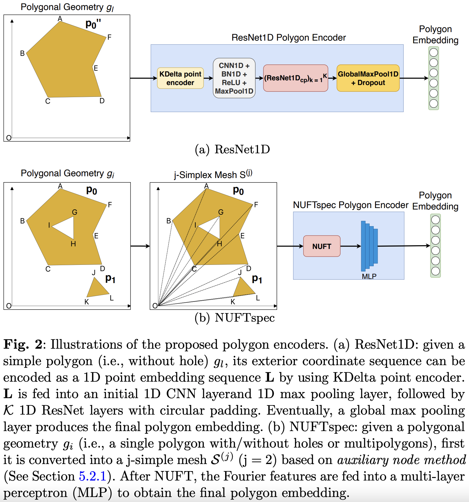

# Towards General-Purpose Representation Learning of Polygonal Geometries
Code for recreting the results in [our GeoInformatica 2023 paper](https://link.springer.com/article/10.1007/s10707-022-00481-2)


## Related Link
1. [Springr Paper](https://link.springer.com/article/10.1007/s10707-022-00481-2)
2. [Arxiv Paper](https://arxiv.org/abs/2209.15458)

## Award
1. This paper won [AAG 2023 J. Warren Nystrom Award (1 award recipient every year)](https://www.aag.org/award-grant/nystrom/)
2. This paper won [AAG 2022 William L. Garrison Award for Best Dissertation in Computational Geography (1 award recipient every other year)](https://www.aag.org/aag-announces-2022-award-recipients/)

## Our Model Overview
<p align="center">
  
</p>

## Dependencies
- Python 3.7+
- Torch 1.7.1+
- Other required packages are summarized in `requirements.txt`.

## Data
Download the required dbtopo datasets from [here](https://www.dropbox.com/scl/fo/ubokquibjibxqb71lduto/h?rlkey=gnex7g3gx51g06gmd1v1um9u1&dl=0) and put them in `./data_proprocessing/dbtopo/output/` folder. The folder has two datasets:
1) DBSR-46K: the `pgon_triples_geom_300_norm_df.pkl`file, a GeoDataFrame contain the DBSR-46K spatial relation prediction dataset created from DBpedia and OpenStreetMap. Each row indicates a triple from DBpedia and its subject and object are presented as a simple polygon with 300 vertices.
2) DBSR-cplx46K: the `pgon_triples_geom_300_norm_df_complex.pkl` file, a  GeoDataFrame contain the spatial relation prediction dataset. The only difference is each row's subject and object are presented as a complex polygon with 300 vertices.


## Train and Evaluation
The main code are located in `polygoncode` folder

1) `1_pgon_dbtopo.sh` do suprevised training on both DBSR-46K and DBSR-cplx46K datasets.  


### Reference
If you find our work useful in your research please consider citing [our GeoInformatica 2023 paper](https://link.springer.com/article/10.1007/s10707-022-00481-2).  
```
@article{mai2023towards,
  title={Towards general-purpose representation learning of polygonal geometries},
  author={Mai, Gengchen and Jiang, Chiyu and Sun, Weiwei and Zhu, Rui and Xuan, Yao and Cai, Ling and Janowicz, Krzysztof and Ermon, Stefano and Lao, Ni},
  journal={GeoInformatica},
  volume={27},
  number={2},
  pages={289--340},
  year={2023},
  publisher={Springer}
}
```


Please go to [Dr. Gengchen Mai's Homepage](https://gengchenmai.github.io/) for more information about Spatially Explicit Machine Learning and Artificial Intelligence.